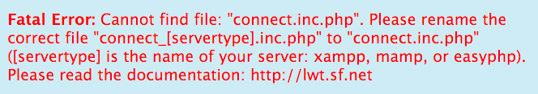

## Questions and Answers

*   I want to use LWT, and I see something like this:  
      
      
      
    Answer: Your local webserver (Apache) is not running. Please start it via EasyPHP or MAMP control program/panel.  
      
    
*   I want to use LWT, and I see something like this:  
      
      
      
    Answer: The server is running, but the application is not found. Maybe the Uniform Resource Identifier (URI) is wrong or misspelled. Please check/correct it. Or the URI is correct, and the application is installed, but not in the correct directory _lwt_ below _htdocs_. Please install/copy/move it into the correct directory.  
      
    
*   I want to use LWT, and I see this:  
      
      
      
    Answer: Either the database (MySQL) is not running, or the database connection parameters in _../htlwt/connect.inc.php_ are wrong. Please check/correct the database connection parameters and/or start MySQL via the MAMP or EasyPHP control program/panel.  
      
    
*   I want to use LWT, and I see this:  
      
      
      
    Answer: The Webserver and the database is running, but the database connection parameter file _../htlwt/connect.inc.php_ is not found. Please rename one of the connection files (according to your server) to _../htlwt/connect.inc.php_.  
      
    
*   I have installed or updated LWT on Linux, but the application does not run as expected:  
      
    Answer 1: The Webserver does not have full access to all LWT files (insufficient rights). Open a terminal window, go to the directory where the directory "lwt" has been created with all LWT files, e. g.  
    **cd /var/www/html**  
    Now execute:  
    **sudo chmod -R 755 lwt**.  
      
    Answer 2: The PHP "mbstring" extension is not installed. Please install it; [see this article](https://askubuntu.com/questions/491629/how-to-install-php-mbstring-extension-in-ubuntu).